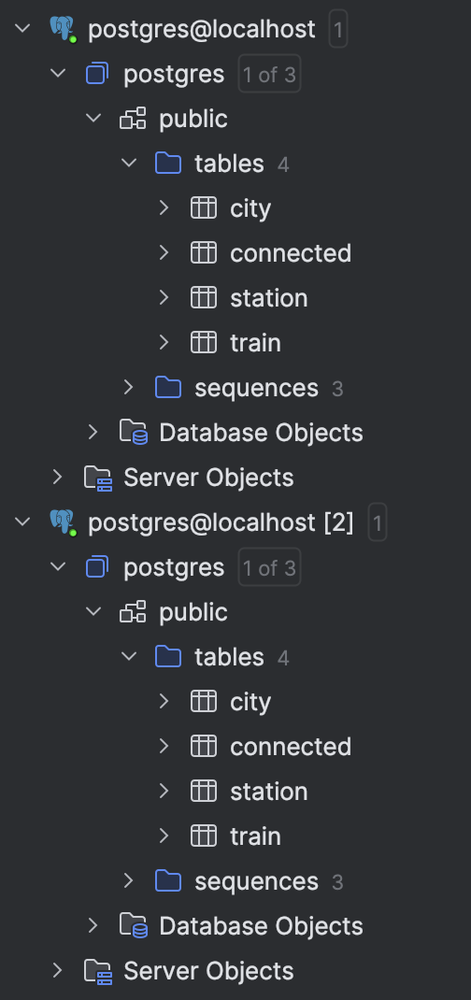
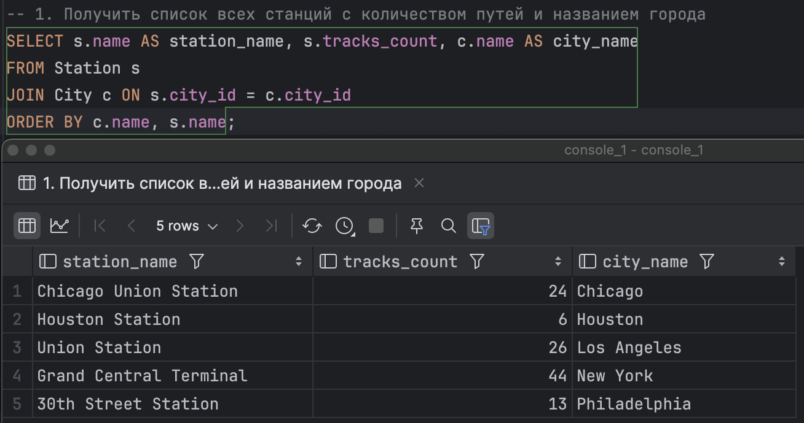
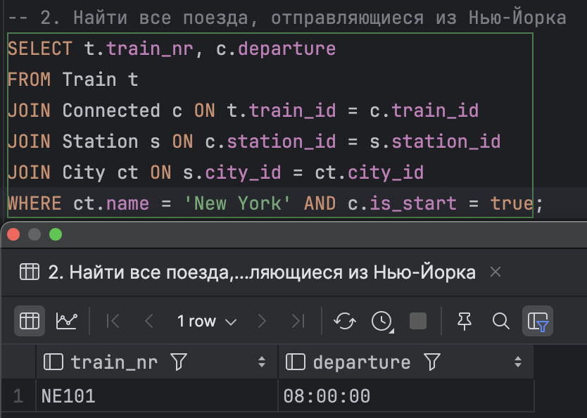
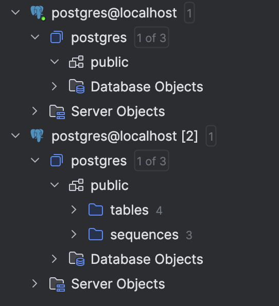

# ДЗ 4
### Шиверских Елизавета Анатольевна БПИ223

Этот проект демонстрирует настройку и использование баз данных PostgreSQL с использованием контейнеров Docker.

## Настройка

1. Создайте файл `docker-compose.yml` с двумя сервисами PostgreSQL:

```yaml
services:
  postgresql-1:
    image: postgres
    restart: always
    container_name: local-postgres-1
    environment:
      - "POSTGRES_USER=postgres"
      - "POSTGRES_DB=postgres"
      - "POSTGRES_HOST_AUTH_METHOD=trust"
    ports:
      - 15432:5432
  postgresql-2:
    image: postgres
    restart: always
    container_name: local-postgres-2
    environment:
      - "POSTGRES_USER=postgres"
      - "POSTGRES_DB=postgres"
      - "POSTGRES_HOST_AUTH_METHOD=trust"
    ports:
      - 25432:5432
    volumes:
      - ./postgres-data:/var/lib/postgresql/data
```

2. Запустите контейнеры:

```bash
docker-compose up -d
```

## Загрузка данных

1. Создайте таблицы базы данных:

```bash
psql -h localhost -p 15432 -U postgres -d postgres -a -f create_databases.sql
psql -h localhost -p 25432 -U postgres -d postgres -a -f create_databases.sql
```

2. Заполните таблицы данными:

```bash
psql -h localhost -p 15432 -U postgres -d postgres -a -f fill_databases.sql
psql -h localhost -p 25432 -U postgres -d postgres -a -f fill_databases.sql
```

## Подключение к базе данных

Подключитесь к базам данных, используя DataGrip:

- Хост: localhost
- Порт: 15432 (для postgresql-1) или 25432 (для postgresql-2)
- Пользователь: postgres
- База данных: postgres



## Тестовые запросы

Выполните следующие SQL-запросы:

1. Список всех станций с названиями городов:
```sql
SELECT s.name AS station_name, c.name AS city_name
FROM Station s
JOIN City c ON s.city_id = c.city_id;
ORDER BY c.name, s.name;
```

2. Найти все поезда, отправляющиеся из Нью-Йорка:
```sql
SELECT t.train_nr, c.departure
FROM Train t
JOIN Connected c ON t.train_id = c.train_id
JOIN Station s ON c.station_id = s.station_id
JOIN City ct ON s.city_id = ct.city_id
WHERE ct.name = 'New York' AND c.is_start = true;
```

Результаты представлены ниже:


*Результаты для обеих баз данных одинаковы, тк и там, и там одни и те же данные*

## Удаление контейнеров

Удалите контейнеры:

```bash
docker-compose down
```
При попытке подключения, DataGrip сообщает об ошибках:


## Проверка сохранности данных

1. Запустите контейнеры снова:

```bash
docker-compose up -d
```

2. Подключитесь к базам данных и снова выполните тестовые запросы.



## Результаты

### Начальная настройка и запросы
При первоначальном запуске оба контейнера успешно создались и заполнились данными. Тестовые запросы выполнились успешно на обоих контейнерах, возвращая ожидаемые результаты по станциям и поездам.

### Сохранность данных
После удаления и повторного запуска контейнеров обнаружилось следующее:

1. Контейнер на порту 25432 (postgresql-2):
   - Данные сохранились
   - Все таблицы и записи остались на месте
   - Тестовые запросы вернули те же результаты, что и до перезапуска

2. Контейнер на порту 15432 (postgresql-1):
   - Данные не сохранились
   - После перезапуска база данных оказалась пустой
   - Тестовые запросы не выполнились из-за отсутствия таблиц

Это различие объясняется тем, что у контейнера postgresql-2 был настроен volume (`./postgres-data:/var/lib/postgresql/data`), который сохранил данные вне контейнера. У контейнера postgresql-1 volume не был настроен, поэтому все данные хранились внутри контейнера и были утеряны при его удалении.
